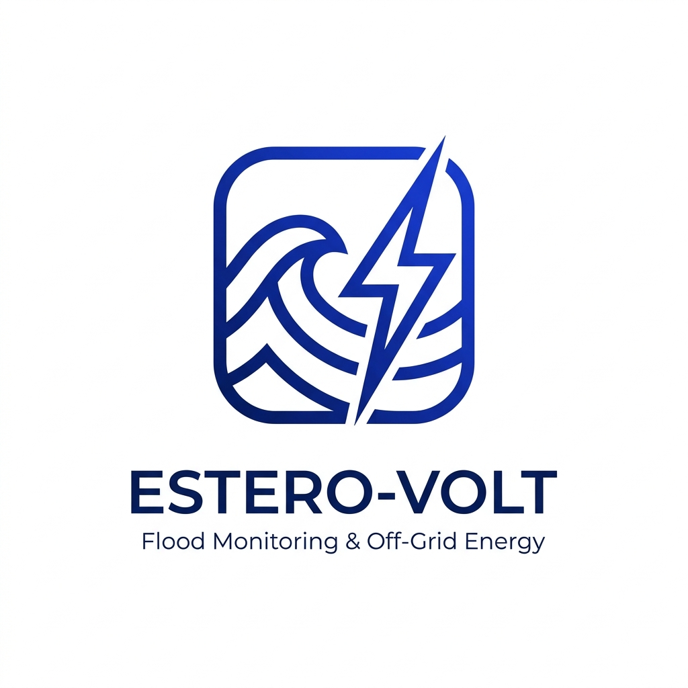
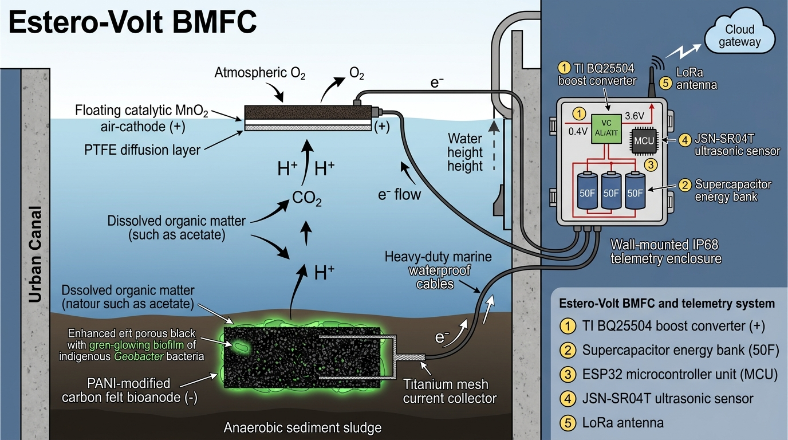
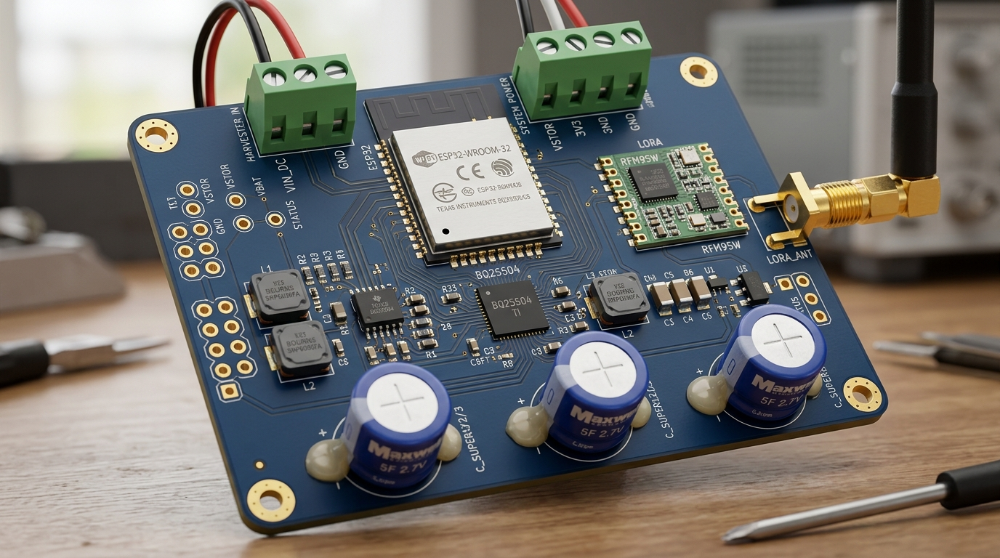
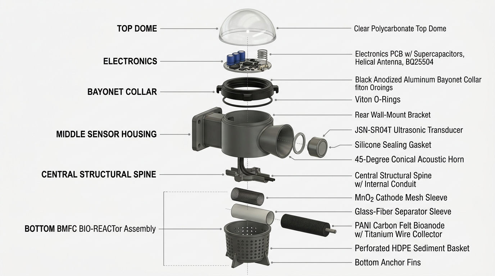
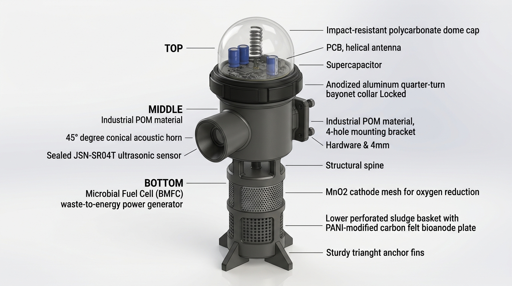

<p align="center">
  
</p>

<h1 align="center">Estero-Volt: Off-Grid Bio-Electrochemical IoT Telemetry Node</h1>
<h3 align="center">Continuous Micro-Power Recovery from Urban Wastewater via Microbial Fuel Cells to Drive Off-Grid Flood Telemetry</h3>

<p align="center">
  <a href="https://github.com/venstqs/WATT-The-WASTE-Hardware-Architecture"></a>
  <a href="LICENSE"></a>
  <a href="https://www.espressif.com"></a>
  <a href="https://www.ti.com"></a>
  <a href="https://www.semtech.com"></a>
</p>

---

## 1. Project Overview

**Estero-Volt** is an autonomous, self-powered environmental edge-sensing node engineered for deployment in high-load anaerobic urban waterways (*esteros*). Urban drainage canals in the Global South suffer from excessive organic pollution (elevated Biological and Chemical Oxygen Demand — BOD/COD) and extreme vulnerability to pluvial flash flooding. Conventional telemetry nodes rely on toxic, disposable chemical batteries (which leak under high humidity and heat) or photovoltaic solar panels (which suffer severe bio-fouling, trash accumulation, and dark downtime during multi-day tropical typhoons).

Estero-Volt eradicates both constraints by converting the biochemical metabolic activity of indigenous exoelectrogenic microorganisms (*Geobacter sulfurreducens*, *Shewanella*) directly into electrical potential via a sub-surface **Benthic Microbial Fuel Cell (BMFC)**. 

Harvesting continuous micro-power ($0.30\,\text{V} - 0.50\,\text{V}$, $\sim 3.2\,\text{mW}$ baseline) using an ultra-low-voltage MPPT boost converter (Texas Instruments **BQ25504**), the system buffers electrostatic charge into a high-capacity **supercapacitor bank (16.7 F, 5.5 V rated)**. An **ESP32** microcontroller wakes up via an RTC voltage supervisor interrupt, powers a sealed ultrasonic water-level sensor (**JSN-SR04T**), executes an on-device quantized neural inference model (LSTM) for flood prediction, and broadcasts telemetry over long-range Chirp Spread Spectrum (**LoRaWAN RFM95W**) before returning to sub-$15\,\mu\text{A}$ deep sleep.

<p align="center">
  
</p>

```
       +-------------------------------------------------------+
       |                  ESTERO-VOLT ARCHITECTURE             |
       +-------------------------------------------------------+
       |                                                       |
[Estero Sludge]                                                |
       |                                                       |
  +----+----+        +---------+       +---------------+       |
  |  BMFC   |------->| BQ25504 |------>| Supercap Bank |       |
  | Bioanode| 0.4V   | Boost   | VSTOR | (3x 50F, 5.5V)|       |
  +---------+        | MPPT    |       +-------+-------+       |
                     +---------+               |               |
                          | VBAT_OK            |               |
                          v                    v               |
                     +---------------------------------+       |
                     |  TPS62840 Nano-Power Buck Reg   |       |
                     +----------------+----------------+       |
                                      | 3.3V                   |
                                      v                        |
                     +---------------------------------+       |
                     |   ESP32-WROOM-32E (RTC Core)    |       |
                     +--------+----------------+-------+       |
           Load Switch Ctrl   |                | SPI           |
                     +--------+                v               |
                     |                 +---------------+       |
                     v                 | RFM95W LoRa   |       |
             +---------------+         | (+20dBm Tx)   |----(( LoRaWAN LNS
             | 5V Boost +    |         +---------------+       5-15 km
             | JSN-SR04T     |                                 NLOS ))
             | Ultrasonic Tx |                                 
             +---------------+                                 
```

---

## 2. System Power Budget & Feasibility Validation

The system power management operates under a strict energy-neutrality theorem: **Total Energy Harvested ($E_{harv}$) $\ge$ Total Energy Consumed ($E_{load}$) + Quiescent Losses ($E_Q$)**.

$$\int_{0}^{T_{cycle}} P_{BMFC}(t) \cdot \eta_{boost} \, dt \ge E_{sleep} + E_{sense} + E_{compute} + E_{TX}$$

### 2.1 Empirical Power Budget Specification

| Stage | Subsystem Component | Operating Parameters | Voltage / Current | Duration | Energy / Power |
| :--- | :--- | :--- | :--- | :--- | :--- |
| **Generation** | PANI-Modified BMFC Bioanode | Submerged sludge biofilm | $0.40\,\text{V} \times 8.0\,\text{mA}$ | Continuous | **$\sim 3.20\,\text{mW}$** |
| **Conditioning** | TI BQ25504 Boost Harvester | $\eta = 80\%$ boost efficiency | $V_{OUT} = 3.60\,\text{V}$ | Continuous | **$2.56\,\text{mW}$ net** |
| **Quiescent** | System Deep Sleep | ESP32 RTC + BQ25504 $I_Q$ | $3.3\,\text{V} \times 12.5\,\mu\text{A}$ | $898.8\,\text{s}$ | $37.08\,\text{mJ}$ |
| **Sensing** | JSN-SR04T Ultrasonic Unit | Active acoustic burst | $5.0\,\text{V} \times 30.0\,\text{mA}$ | $35\,\text{ms}$ | $5.25\,\text{mJ}$ |
| **Compute** | ESP32 CPU (Edge-AI LSTM) | Active 80 MHz inference | $3.3\,\text{V} \times 38.0\,\text{mA}$ | $120\,\text{ms}$ | $15.05\,\text{mJ}$ |
| **Telemetry** | RFM95W LoRa Transmit | $+17\,\text{dBm}$ (SF10, BW 125kHz)| $3.3\,\text{V} \times 120.0\,\text{mA}$ | $50\,\text{ms}$ | **$\sim 19.80\,\text{mJ}$** |
| **Total Cycle**| Combined Burst (15-min period)| Active execution window | Dynamic | $205\,\text{ms}$ | **$77.18\,\text{mJ}$ / cycle** |

### 2.2 Recharge Rate & Energy Buffer Analysis

1. **Energy Generated per 15-minute Period ($900\,\text{s}$):**
   $$E_{harvested} = 2.56\,\text{mW} \times 900\,\text{s} = 2,304\,\text{mJ} = 2.304\,\text{J}$$
2. **Total Energy Expended per Period:**
   $$E_{consumed} = E_{active} + E_{sleep} = (5.25 + 15.05 + 19.80)\,\text{mJ} + 37.08\,\text{mJ} = 77.18\,\text{mJ}$$
3. **Energy Margin:**
   $$\text{Margin} = \frac{2304\,\text{mJ} - 77.18\,\text{mJ}}{2304\,\text{mJ}} \times 100\% = \mathbf{96.65\%}$$
4. **Isolated LoRa Transmission Recharge Rate:**
   $$T_{recharge\_RF} = \frac{E_{RF}}{P_{usable}} = \frac{19.8\,\text{mJ}}{2.56\,\text{mW}} = \mathbf{\sim 7.73\,\text{seconds}}$$

The biological fuel cell generates **nearly 30 times more energy** than required for a standard 15-minute transmission cadence. This guarantees uninterrupted operation even during seasonal bio-inhibition, severe chemical dilution during torrential rains, or temporary sludge scour.

<p align="center">
  
</p>

---

## 3. Tripartite Mechanical Form Factor

The mechanical architecture is designed to withstand severe tropical storms, hydraulic drag from canal debris, and corrosive sewer gas environments ($H_2S$, $NH_3$) through a 3-stage modular assembly:

<p align="center">
  
</p>

<p align="center">
  
</p>

1. **Top Section (Electronic Cap - IP68):**
   - Hermetically sealed with dual Viton fluoropolymer O-rings.
   - Houses the circular control PCB, supercapacitors, and quarter-wave helical LoRa antenna.
   - Features a quarter-turn bayonet "twist-and-swap" locking collar. Maintenance personnel can service the electronics without extracting the benthic assembly from the sewer sludge.
2. **Middle Section (Sensor Housing & Wall Bracket):**
   - Wall-mounted to canal masonry or bridge piers via a 4-bolt reinforced flange bracket.
   - Houses the forward-offset downward-facing waterproof ultrasonic transducer (IP67) inside a conical acoustic horn baffle ($45^\circ$ draft) with an undercut drip lip to prevent condensation bridging.
3. **Bottom Section (Submerged Bio-Reactor):**
   - Perforated, heavy-gauge non-conductive HDPE enclosure anchored into the anaerobic estero sediment with bottom stabilizer tines.
   - Houses the $100\,\text{cm}^2$ Polyaniline (PANI)-modified carbon felt bioanode and titanium current collector mesh, connected to the main unit via an IP68 marine neoprene cable gland.

---

## 4. Repository Documentation Index

This repository contains the complete production-grade hardware engineering artifacts for reproducing, certifying, and deploying Estero-Volt nodes:

* [**`docs/MECHANICAL_CAD.md`**](docs/MECHANICAL_CAD.md): **Autodesk Fusion 360 parametric modeling guide**, cross-section cutaways, O-ring gland dimensions, tolerances, and 3D printing parameters.
* [**`docs/SCHEMATICS.md`**](docs/SCHEMATICS.md): Complete electrical theory, power stages, logic level conversion, BQ25504 MPPT programming calculations, and pin-to-pin wiring netlists.
* [**`docs/PCB_DESIGN.md`**](docs/PCB_DESIGN.md): 4-layer stackup rules, high-current RF layout rules, star-grounding architecture, creepage/clearance, and $H_2S$ anti-corrosion fabrication standards.
* [**`docs/FIRMWARE.md`**](docs/FIRMWARE.md): Ultra-low power embedded C++ firmware architecture, RTC wake-up sequencing, JSN-SR04T driver, SX1276 LoRaWAN payload encoding, and adaptive duty cycling algorithms.
* [**`docs/BOM.md`**](docs/BOM.md): Complete Engineering Bill of Materials with exact manufacturer part numbers (MPNs), footprints, voltage/temperature ratings, and procurement sources.
* [**`firmware/src/main.cpp`**](firmware/src/main.cpp): Production-ready C++ firmware implementation for PlatformIO / ESP-IDF.

---

## 5. License & Open Hardware Compliance

Hardware schematics and PCB designs are licensed under the **CERN Open Hardware Licence Version 2 - Strongly Reciprocal (CERN-OHL-S)**. Embedded firmware is licensed under the **Apache License 2.0**.
