<div align="center">


# Estero-Volt

### Off-Grid Bio-Electrochemical IoT Flood Telemetry Node

**Continuous micro-power recovery from urban wastewater via Benthic Microbial Fuel Cells to drive battery-free, solar-free flood early warning.**

<p>
  <a href="https://github.com/venstqs/WATT-The-WASTE-Hardware-Architecture"></a>
  
  
</p>
<p>
  <a href="https://www.espressif.com"></a>
  <a href="https://www.ti.com"></a>
  <a href="https://www.semtech.com"></a>
  <a href="https://platformio.org"></a>
  <a href="https://openscad.org"></a>
</p>

**[Overview](#-1-project-overview)** ·
**[How It Works](#-2-how-it-works)** ·
**[Power Budget](#-3-system-power-budget--feasibility)** ·
**[Mechanical Design](#-4-tripartite-mechanical-form-factor)** ·
**[LoRaWAN Pipeline](#-5-end-to-end-lorawan-telemetry--disaster-alert-pipeline)** ·
**[Quick Start](#-7-quick-start)** ·
**[Docs](#-8-documentation-index)**

<br>

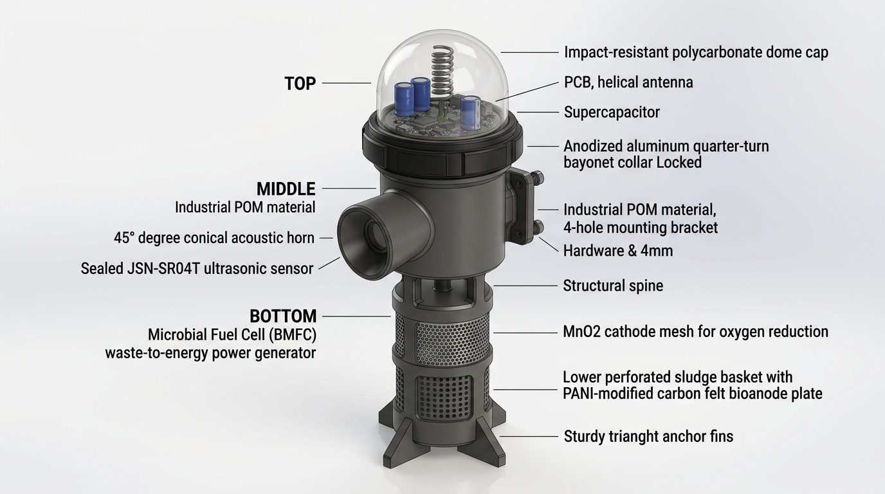

</div>

---

## ⚡ At a Glance

<div align="center">

| 🔋 Power Source | ⚙️ Harvest Output | 📡 Telemetry | 💤 Sleep Current | 🛡️ Enclosure |
| :---: | :---: | :---: | :---: | :---: |
| Benthic Microbial Fuel Cell | **~3.20 mW** gen / **2.56 mW** usable | LoRa CSS · 915 MHz · 5–15 km NLOS | **< 15 µA** | IP68 · 3-part modular |

| 📏 Sensing | 🧠 Edge Compute | 🔌 Energy Buffer | ⏱️ TX Recharge | 📈 Energy Margin |
| :---: | :---: | :---: | :---: | :---: |
| JSN-SR04T ultrasonic water level | ESP32 @ 80 MHz · quantized LSTM | 16.7 F / 5.5 V supercap bank | **~7.73 s** per uplink | **96.65 %** per 15-min cycle |

</div>

---

## 🌊 1. Project Overview

**Estero-Volt** is an autonomous, self-powered environmental edge-sensing node engineered for deployment in high-load anaerobic urban waterways (*esteros*). Urban drainage canals in the Global South suffer from excessive organic pollution (elevated Biological and Chemical Oxygen Demand — BOD/COD) and extreme vulnerability to pluvial flash flooding. Conventional telemetry nodes rely on toxic, disposable chemical batteries (which leak under high humidity and heat) or photovoltaic solar panels (which suffer severe bio-fouling, trash accumulation, and dark downtime during multi-day tropical typhoons).

Estero-Volt eradicates both constraints by converting the biochemical metabolic activity of indigenous exoelectrogenic microorganisms (*Geobacter sulfurreducens*, *Shewanella*) directly into electrical potential via a sub-surface **Benthic Microbial Fuel Cell (BMFC)**.

Harvesting continuous micro-power ($0.30\,\text{V} - 0.50\,\text{V}$, $\sim 3.2\,\text{mW}$ baseline) using an ultra-low-voltage MPPT boost converter (Texas Instruments **BQ25504**), the system buffers electrostatic charge into a high-capacity **supercapacitor bank (16.7 F, 5.5 V rated)**. An **ESP32** microcontroller wakes up via an RTC voltage supervisor interrupt, powers a sealed ultrasonic water-level sensor (**JSN-SR04T**), executes an on-device quantized neural inference model (LSTM) for flood prediction, and broadcasts telemetry over long-range Chirp Spread Spectrum (**LoRaWAN RFM95W**) before returning to sub-$15\,\mu\text{A}$ deep sleep.

> [!IMPORTANT]
> **The problem we solve:** Batteries leak and die. Solar panels foul and go dark during typhoons — exactly when flood data matters most. Estero-Volt is powered by the very wastewater it monitors, so it keeps reporting through the storm.

### 🎯 Target Deployment — Naga City, Camarines Sur

High-risk flood corridors identified for pilot deployment:

| Barangay | Waterway Context |
| :--- | :--- |
| Brgy. Triangulo | Sagop Creek corridor |
| Brgy. Tabuco | Urban estero network |
| Brgy. Mabolo | Riparian flood zone |
| Brgy. Sabang | Riparian flood zone |
| Brgy. Abella | Riparian flood zone |

---

## 🔬 2. How It Works

<p align="center">
  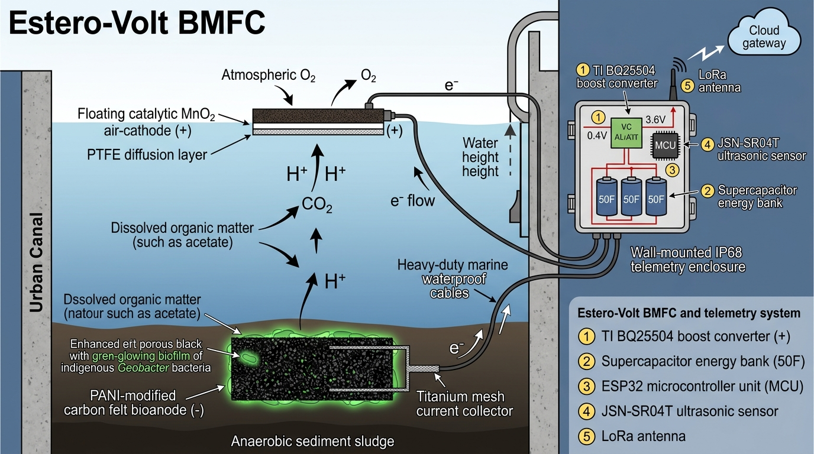
</p>

### 2.1 Energy & Data Flow

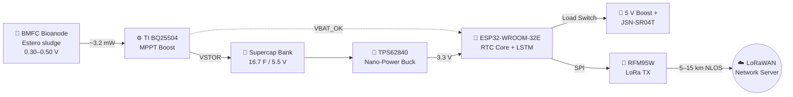
```mermaid
flowchart LR
    A["🦠 BMFC Bioanode<br/>Estero sludge<br/>0.30–0.50 V"] -->|"~3.2 mW"| B["⚙️ TI BQ25504<br/>MPPT Boost"]
    B -->|VSTOR| C["🔋 Supercap Bank<br/>16.7 F / 5.5 V"]
    C --> D["🔽 TPS62840<br/>Nano-Power Buck"]
    B -.->|VBAT_OK| E
    D -->|3.3 V| E["🧠 ESP32-WROOM-32E<br/>RTC Core + LSTM"]
    E -->|Load Switch| F["📏 5 V Boost +<br/>JSN-SR04T"]
    E -->|SPI| G["📡 RFM95W<br/>LoRa TX"]
    G -->|"5–15 km NLOS"| H(("☁️ LoRaWAN<br/>Network Server"))
```

### 2.2 Duty Cycle (every 15 minutes)

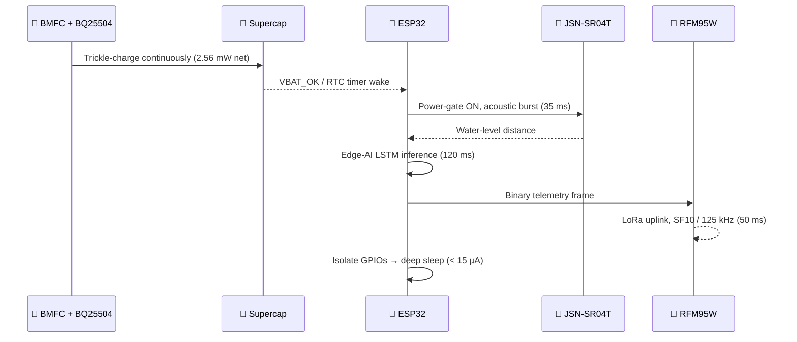
```mermaid
sequenceDiagram
    participant BMFC as 🦠 BMFC + BQ25504
    participant CAP as 🔋 Supercap
    participant MCU as 🧠 ESP32
    participant SNS as 📏 JSN-SR04T
    participant RF as 📡 RFM95W
    BMFC->>CAP: Trickle-charge continuously (2.56 mW net)
    CAP-->>MCU: VBAT_OK / RTC timer wake
    MCU->>SNS: Power-gate ON, acoustic burst (35 ms)
    SNS-->>MCU: Water-level distance
    MCU->>MCU: Edge-AI LSTM inference (120 ms)
    MCU->>RF: Binary telemetry frame
    RF-->>RF: LoRa uplink, SF10 / 125 kHz (50 ms)
    MCU->>MCU: Isolate GPIOs → deep sleep (< 15 µA)
```

<details>
<summary><b>📟 ASCII block diagram (plain-text view)</b></summary>

```
       +-------------------------------------------------------+
       |                  ESTERO-VOLT ARCHITECTURE             |
       +-------------------------------------------------------+
       |                                                       |
[Estero Sludge]                                                |
       |                                                       |
  +----+----+        +---------+       +---------------+       |
  |  BMFC   |------->| BQ25504 |------>| Supercap Bank |       |
  | Bioanode| 0.4V   | Boost   | VSTOR | (3x 50F, 5.5V)|       |
  +---------+        | MPPT    |       +-------+-------+       |
                     +---------+               |               |
                          | VBAT_OK            |               |
                          v                    v               |
                     +---------------------------------+       |
                     |  TPS62840 Nano-Power Buck Reg   |       |
                     +----------------+----------------+       |
                                      | 3.3V                   |
                                      v                        |
                     +---------------------------------+       |
                     |   ESP32-WROOM-32E (RTC Core)    |       |
                     +--------+----------------+-------+       |
           Load Switch Ctrl   |                | SPI           |
                     +--------+                v               |
                     |                 +---------------+       |
                     v                 | RFM95W LoRa   |       |
             +---------------+         | (+20dBm Tx)   |----(( LoRaWAN LNS
             | 5V Boost +    |         +---------------+       5-15 km
             | JSN-SR04T     |                                 NLOS ))
             | Ultrasonic Tx |
             +---------------+
```

</details>

### 2.3 Electrical Schematic

<p align="center">
  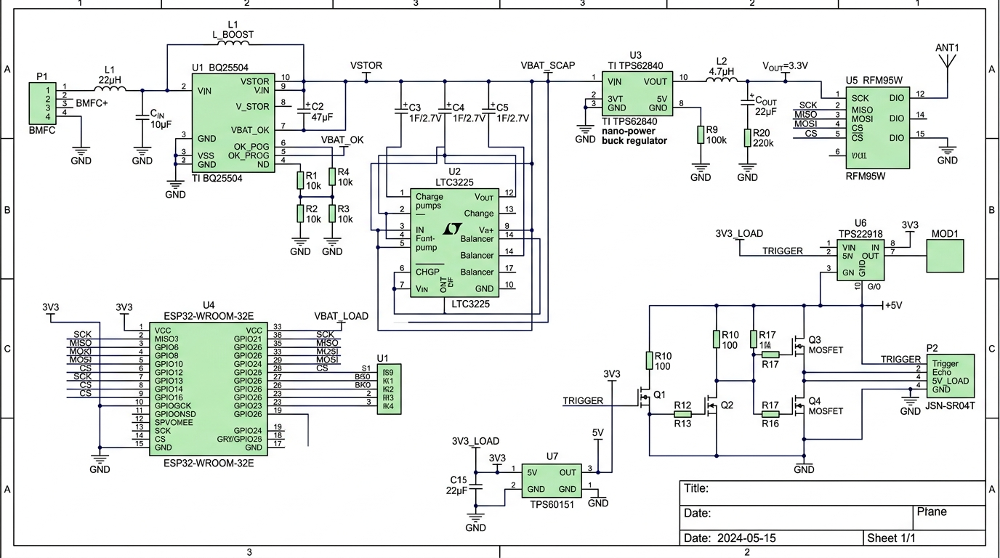
</p>

> Full circuit theory, BQ25504 MPPT resistor calculations, and pin-to-pin netlists: **[`docs/SCHEMATICS.md`](docs/SCHEMATICS.md)**

---

## 🔋 3. System Power Budget & Feasibility

The system power management operates under a strict energy-neutrality theorem: **Total Energy Harvested ($E_{harv}$) $\ge$ Total Energy Consumed ($E_{load}$) + Quiescent Losses ($E_Q$)**.

$$\int_{0}^{T_{cycle}} P_{BMFC}(t) \cdot \eta_{boost} \, dt \ge E_{sleep} + E_{sense} + E_{compute} + E_{TX}$$

### 3.1 Empirical Power Budget Specification

| Stage | Subsystem Component | Operating Parameters | Voltage / Current | Duration | Energy / Power |
| :--- | :--- | :--- | :--- | :--- | :--- |
| **Generation** | PANI-Modified BMFC Bioanode | Submerged sludge biofilm | $0.40\,\text{V} \times 8.0\,\text{mA}$ | Continuous | **$\sim 3.20\,\text{mW}$** |
| **Conditioning** | TI BQ25504 Boost Harvester | $\eta = 80\%$ boost efficiency | $V_{OUT} = 3.60\,\text{V}$ | Continuous | **$2.56\,\text{mW}$ net** |
| **Quiescent** | System Deep Sleep | ESP32 RTC + BQ25504 $I_Q$ | $3.3\,\text{V} \times 12.5\,\mu\text{A}$ | $898.8\,\text{s}$ | $37.08\,\text{mJ}$ |
| **Sensing** | JSN-SR04T Ultrasonic Unit | Active acoustic burst | $5.0\,\text{V} \times 30.0\,\text{mA}$ | $35\,\text{ms}$ | $5.25\,\text{mJ}$ |
| **Compute** | ESP32 CPU (Edge-AI LSTM) | Active 80 MHz inference | $3.3\,\text{V} \times 38.0\,\text{mA}$ | $120\,\text{ms}$ | $15.05\,\text{mJ}$ |
| **Telemetry** | RFM95W LoRa Transmit | $+17\,\text{dBm}$ (SF10, BW 125kHz)| $3.3\,\text{V} \times 120.0\,\text{mA}$ | $50\,\text{ms}$ | **$\sim 19.80\,\text{mJ}$** |
| **Total Cycle**| Combined Burst (15-min period)| Active execution window | Dynamic | $205\,\text{ms}$ | **$77.18\,\text{mJ}$ / cycle** |

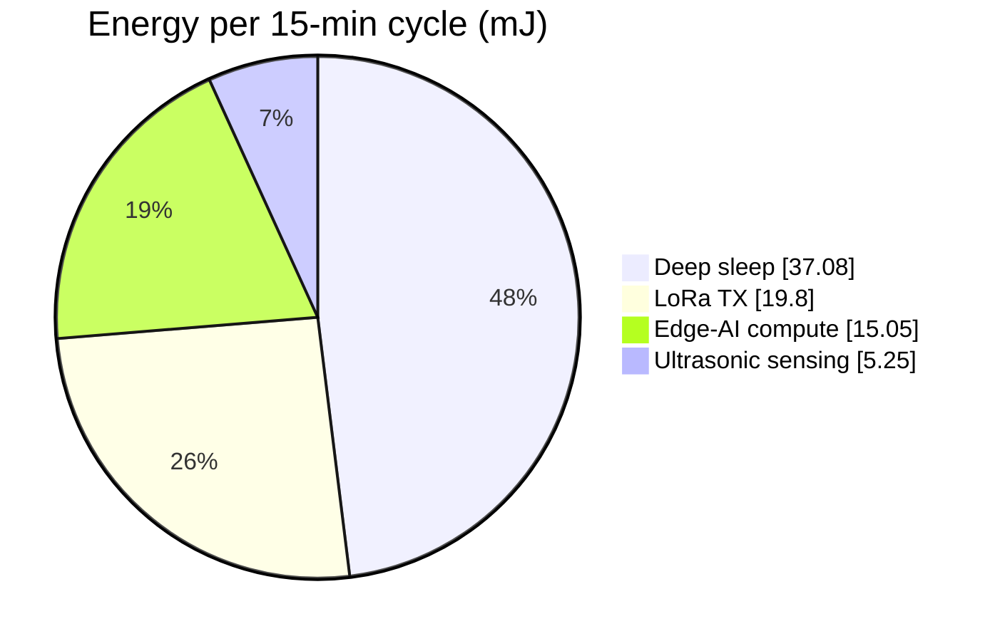
```mermaid
pie showData
    title Energy per 15-min cycle (mJ)
    "Deep sleep" : 37.08
    "LoRa TX" : 19.80
    "Edge-AI compute" : 15.05
    "Ultrasonic sensing" : 5.25
```

### 3.2 Recharge Rate & Energy Buffer Analysis

<details open>
<summary><b>🧮 Show the math</b></summary>

1. **Energy Generated per 15-minute Period ($900\,\text{s}$):**
   $$E_{harvested} = 2.56\,\text{mW} \times 900\,\text{s} = 2,304\,\text{mJ} = 2.304\,\text{J}$$
2. **Total Energy Expended per Period:**
   $$E_{consumed} = E_{active} + E_{sleep} = (5.25 + 15.05 + 19.80)\,\text{mJ} + 37.08\,\text{mJ} = 77.18\,\text{mJ}$$
3. **Energy Margin:**
   $$\text{Margin} = \frac{2304\,\text{mJ} - 77.18\,\text{mJ}}{2304\,\text{mJ}} \times 100\% = \mathbf{96.65\%}$$
4. **Isolated LoRa Transmission Recharge Rate:**
   $$T_{recharge\_RF} = \frac{E_{RF}}{P_{usable}} = \frac{19.8\,\text{mJ}}{2.56\,\text{mW}} = \mathbf{\sim 7.73\,\text{seconds}}$$

</details>

> [!TIP]
> The biological fuel cell generates **nearly 30 times more energy** than required for a standard 15-minute transmission cadence. This guarantees uninterrupted operation even during seasonal bio-inhibition, severe chemical dilution during torrential rains, or temporary sludge scour.

---

## 🛠️ 4. Tripartite Mechanical Form Factor

The mechanical architecture is designed to withstand severe tropical storms, hydraulic drag from canal debris, and corrosive sewer gas environments ($H_2S$, $NH_3$) through a 3-stage modular assembly:

<p align="center">
  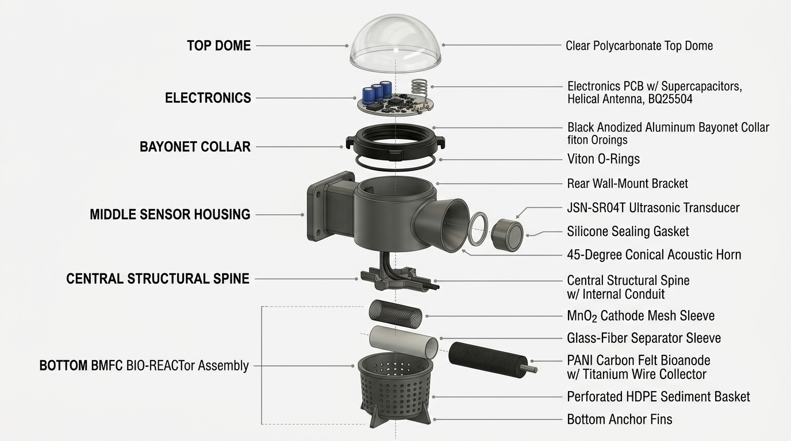
</p>

| | Section | Key Features |
| :---: | :--- | :--- |
| 🔝 | **Top — Electronic Cap (IP68)** | Hermetically sealed with dual Viton fluoropolymer O-rings. Houses the circular control PCB, supercapacitors, and quarter-wave helical LoRa antenna. Quarter-turn bayonet **"twist-and-swap"** locking collar lets maintenance personnel service the electronics without extracting the benthic assembly from the sewer sludge. |
| 🧱 | **Middle — Sensor Housing & Wall Bracket** | Wall-mounted to canal masonry or bridge piers via a 4-bolt reinforced flange bracket. Houses the forward-offset, downward-facing waterproof ultrasonic transducer (IP67) inside a conical acoustic horn baffle ($45^\circ$ draft) with an undercut drip lip to prevent condensation bridging. |
| 🦠 | **Bottom — Submerged Bio-Reactor** | Perforated, heavy-gauge non-conductive HDPE enclosure anchored into the anaerobic estero sediment with bottom stabilizer tines. Houses the $100\,\text{cm}^2$ Polyaniline (PANI)-modified carbon felt bioanode and titanium current collector mesh, connected to the main unit via an IP68 marine neoprene cable gland. |

### 📐 CAD Gallery

<table>
  <tr>
    <td align="center" width="50%">
      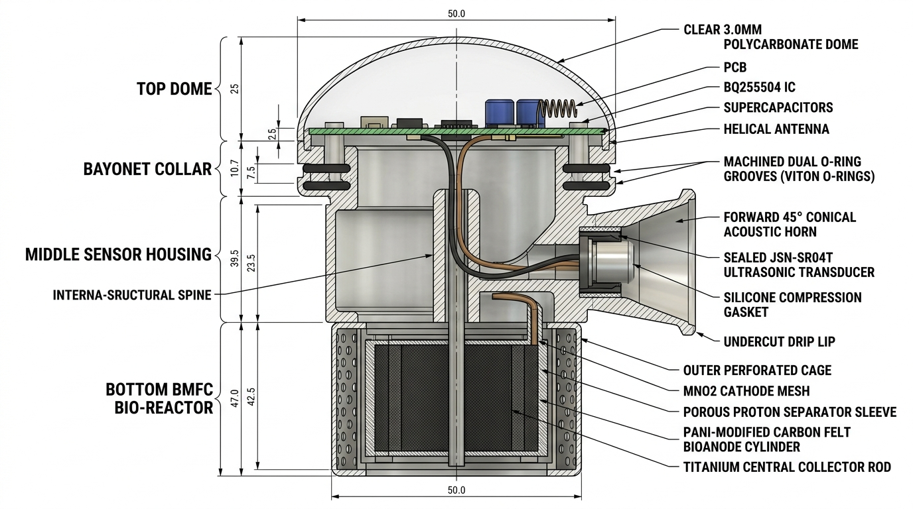<br>
      <sub><b>Sagittal Cross-Section</b> — internal conduit & concentric electrodes</sub>
    </td>
    <td align="center" width="50%">
      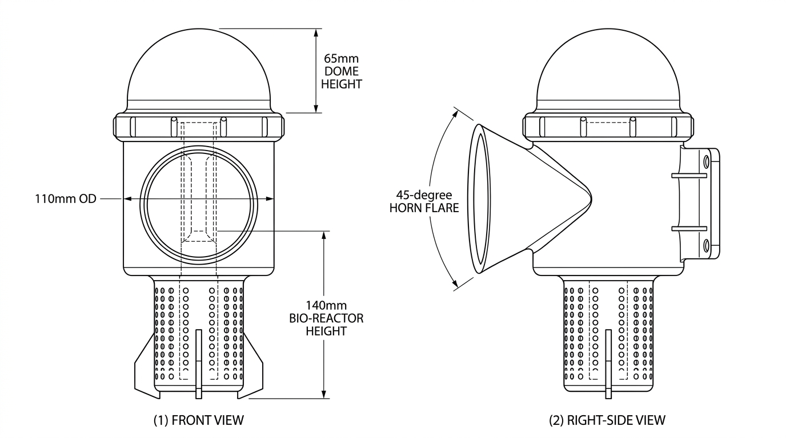<br>
      <sub><b>Orthographic Blueprint</b> — reference for Fusion 360 sketching</sub>
    </td>
  </tr>
</table>

> Parametric source: **[`hardware/cad/estero_volt_enclosure.scad`](hardware/cad/estero_volt_enclosure.scad)** · Pre-exported meshes: **[`hardware/cad/stl/`](hardware/cad/stl/)** · Modeling guide: **[`docs/MECHANICAL_CAD.md`](docs/MECHANICAL_CAD.md)**

---

## 📡 5. End-to-End LoRaWAN Telemetry & Disaster Alert Pipeline

Estero-Volt integrates into municipal flood early warning networks, bridging ultra-low-power field sensor nodes with city-wide disaster response operations and riparian citizen alerts.

<p align="center">
  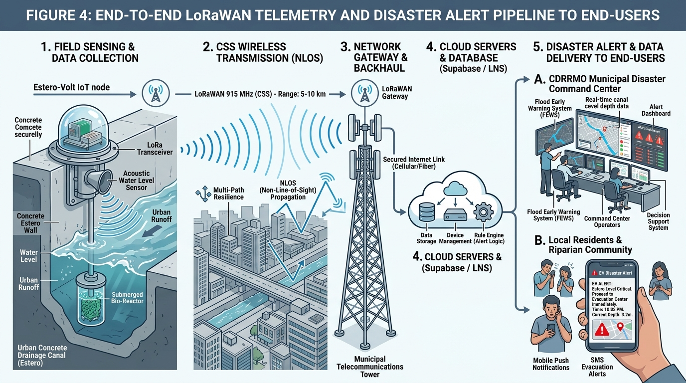
</p>

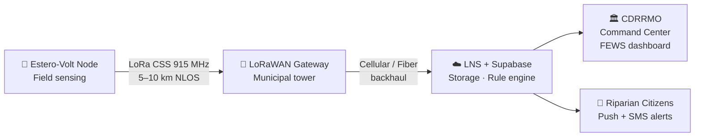
```mermaid
flowchart LR
    N["🌊 Estero-Volt Node<br/>Field sensing"] -->|"LoRa CSS 915 MHz<br/>5–10 km NLOS"| GW["🗼 LoRaWAN Gateway<br/>Municipal tower"]
    GW -->|"Cellular / Fiber<br/>backhaul"| LNS["☁️ LNS + Supabase<br/>Storage · Rule engine"]
    LNS --> CD["🏛️ CDRRMO<br/>Command Center<br/>FEWS dashboard"]
    LNS --> CZ["📱 Riparian Citizens<br/>Push + SMS alerts"]
```

| # | Stage | Description |
| :---: | :--- | :--- |
| 1 | **Field Sensing & Data Collection** | The self-powered tripartite node, wall-mounted in the *estero*, samples canal flood depth via its cantilevered ultrasonic transducer, powered entirely by the BMFC. |
| 2 | **CSS Wireless Transmission** | Telemetry packets are modulated via LoRa 915 MHz Chirp Spread Spectrum, tolerating dense urban concrete and multi-path fading over a Non-Line-of-Sight (NLOS) link. |
| 3 | **Municipal Gateway & Backhaul** | Multi-channel LoRaWAN gateways on city telecom towers receive packets and forward them over encrypted cellular (4G/5G) or fiber backhaul. |
| 4 | **Cloud Processing (Supabase / LNS)** | The LoRaWAN Network Server (The Things Network / ChirpStack) and Supabase backend validate payloads, store time-series hydrographs, and evaluate threshold alert logic. |
| 5A | **CDRRMO Command Center** | Operators monitor live water levels, rate-of-rise trends, and alerts on the Flood Early Warning System (FEWS) console. |
| 5B | **Riparian Citizens** | Residents along flood corridors receive automated, localized mobile push notifications and SMS evacuation warnings. |

---

## 🧱 6. Repository Structure

```text
WATT-The-WASTE-Hardware-Architecture/
├── 📄 README.md                     ← You are here
├── 📁 docs/
│   ├── SCHEMATICS.md                ← Circuit theory, MPPT calcs, netlists
│   ├── PCB_DESIGN.md                ← 4-layer stackup, 50 Ω RF, H₂S hardening
│   ├── FIRMWARE.md                  ← Deep-sleep state machine, payload format
│   ├── BOM.md                       ← Bill of materials with exact MPNs
│   ├── MECHANICAL_CAD.md            ← Fusion 360 modeling guide
│   └── images/                      ← Renders, schematics, figures
├── 📁 firmware/
│   ├── platformio.ini               ← ESP32 @ 80 MHz build config
│   ├── include/config.h             ← Pin map & tunable thresholds
│   └── src/main.cpp                 ← Production firmware
└── 📁 hardware/
    ├── cad/
    │   ├── estero_volt_enclosure.scad   ← Parametric OpenSCAD model
    │   └── stl/                         ← Pre-exported printable parts
    ├── schematics/
    ├── pcb_layout/
    └── datasheets/
```

---

## 🚀 7. Quick Start

### 🔧 Build & Flash the Firmware

Requires [PlatformIO](https://platformio.org/install) (VS Code extension or CLI).

```bash
git clone https://github.com/venstqs/WATT-The-WASTE-Hardware-Architecture.git
cd WATT-The-WASTE-Hardware-Architecture/firmware

pio run                      # build for esp32dev
pio run --target upload      # flash over USB
pio device monitor -b 115200 # serial console
```

> [!NOTE]
> The CPU is intentionally downclocked to **80 MHz** in `platformio.ini` to cut active current. Pin assignments and thresholds live in [`firmware/include/config.h`](firmware/include/config.h).

### 🧊 Render / Print the Enclosure

1. Install **[OpenSCAD](https://openscad.org)** (free).
2. Open [`hardware/cad/estero_volt_enclosure.scad`](hardware/cad/estero_volt_enclosure.scad) and set `VIEW_MODE` (`"assembled"`, `"exploded"`, `"dome_only"`, `"collar_only"`, `"housing_only"`, `"reactor_only"`).
3. Press **F6** to render and **F7** to export STL — or grab the ready-made parts in [`hardware/cad/stl/`](hardware/cad/stl/).

| File | Part |
| :--- | :--- |
| `1_top_dome.stl` | Clear electronics dome |
| `2_bayonet_collar.stl` | Bayonet locking collar (dual O-ring grooves) |
| `3_middle_housing.stl` | Sensor housing + 45° acoustic horn + wall bracket |
| `4_bottom_bio_reactor.stl` | Submerged BMFC reactor basket |
| `5_full_assembly_exploded.stl` | Full exploded assembly (showcase) |

> [!TIP]
> GitHub can preview `.stl` files in 3D — just click any file in the [`stl/`](hardware/cad/stl/) folder.

---

## 📚 8. Documentation Index

| Document | What's Inside |
| :--- | :--- |
| 🧊 [**`hardware/cad/`**](hardware/cad/) | Parametric 3D enclosure models (`.scad`), STL exports, and 3D printing guide (Onshape, Fusion 360, FabLabs, JLCPCB) |
| 📐 [**`docs/MECHANICAL_CAD.md`**](docs/MECHANICAL_CAD.md) | Autodesk Fusion 360 parametric modeling guide, cross-section cutaways, O-ring gland dimensions, tolerances, print parameters |
| ⚡ [**`docs/SCHEMATICS.md`**](docs/SCHEMATICS.md) | Electrical theory, power stages, logic level conversion, BQ25504 MPPT calculations, pin-to-pin netlists |
| 🟩 [**`docs/PCB_DESIGN.md`**](docs/PCB_DESIGN.md) | 4-layer stackup rules, RF layout, star-grounding, creepage/clearance, $H_2S$ anti-corrosion fabrication standards |
| 💾 [**`docs/FIRMWARE.md`**](docs/FIRMWARE.md) | Ultra-low-power C++ architecture, RTC wake-up sequencing, JSN-SR04T driver, SX1276 payload encoding, adaptive duty cycling |
| 🧾 [**`docs/BOM.md`**](docs/BOM.md) | Engineering Bill of Materials with exact MPNs, footprints, ratings, and procurement sources |
| 🧠 [**`firmware/src/main.cpp`**](firmware/src/main.cpp) | Firmware implementation for PlatformIO / ESP-IDF |

---

## 🗺️ 9. Roadmap

- [x] System architecture & power budget validation
- [x] Electrical schematics & BQ25504 MPPT design
- [x] 4-layer PCB design guidelines
- [x] Low-power ESP32 + LoRa firmware
- [x] Parametric 3D enclosure (OpenSCAD) + STL exports
- [ ] PCB layout files (KiCad) in `hardware/pcb_layout/`
- [ ] Bench test of BMFC output in collected estero sludge
- [ ] Field pilot deployment in a Naga City estero
- [ ] CDRRMO dashboard & citizen alert integration

---

## 📜 10. License & Open Hardware Compliance

Hardware schematics and PCB designs are licensed under the **CERN Open Hardware Licence Version 2 - Strongly Reciprocal (CERN-OHL-S)**. Embedded firmware is licensed under the **Apache License 2.0**.

---

<div align="center">

**Built for the JA WE Challenge by Team WATT The WASTE** ⚡🌊

<sub>Turning the waste in our waterways into the warning that keeps our communities safe.</sub>

</div>
