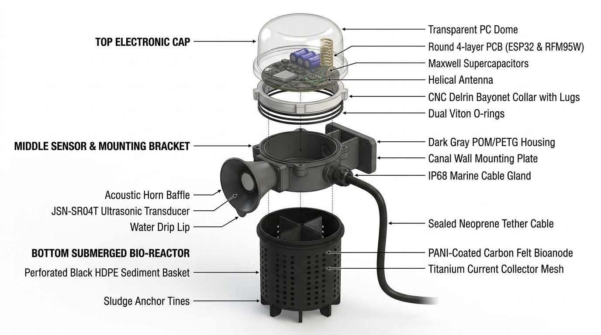
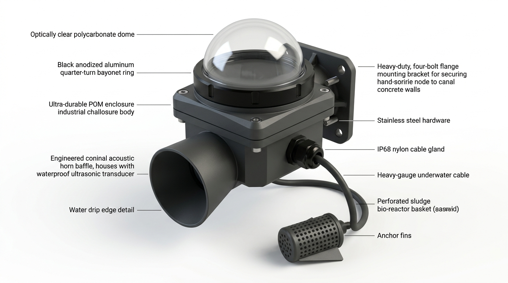
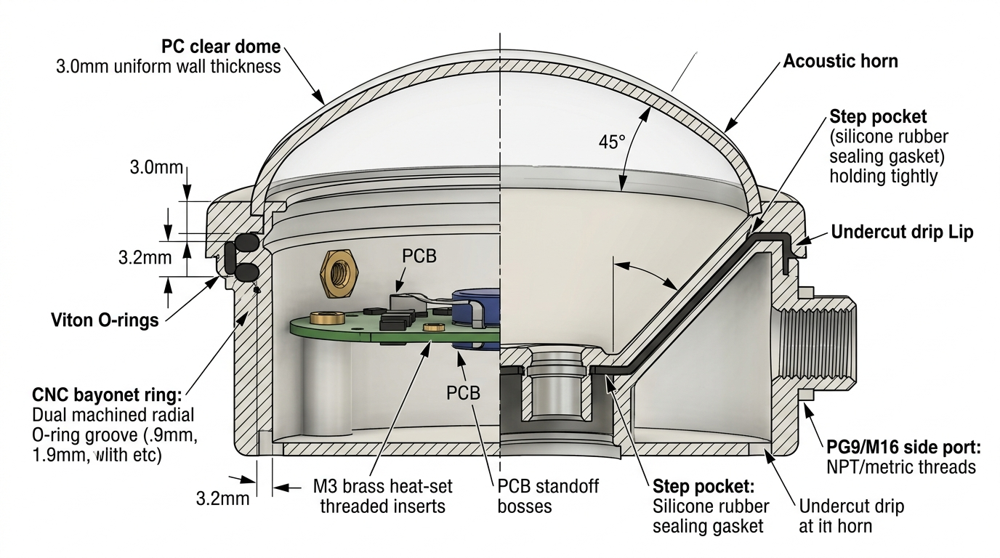

# Autodesk Fusion 360 CAD Design Guide: Estero-Volt Enclosure
### Production-Grade Mechanical Engineering Specification & Parametric Modeling Workflow

[-brightgreen.svg)](docs/MECHANICAL_CAD.md)

---

## 1. Engineering Redesign Rationale & Architecture Fix

In naive early conceptual sketches, remote benthic telemetry nodes were illustrated as a single continuous vertical stack where the electronic cap, ultrasonic sensor, and submerged sludge bio-reactor were aligned along a single vertical axis. 

**The Fatal Physical Flaw:** An ultrasonic transducer (JSN-SR04T) relies on unobstructed acoustic Time-of-Flight (ToF) echoes, featuring a beam divergence angle of $45^\circ - 75^\circ$ and a minimum blind zone of $20\,\text{cm}$. In a continuous vertical cylinder, acoustic pings bounce directly off the top of the bio-reactor cage or electrode cables rather than the fluctuating canal water surface.

  

### The Revision 2.0 Engineering Solution:
1. **Separated Operational Domains**:
   - **Electronic Cap & Sensor Module**: Mounted securely to the canal retaining wall or bridge pier above the historical 100-year flood watermark.
   - **Forward-Offset Acoustic Horn**: The downward-facing JSN-SR04T transducer is housed inside an angled conical baffle extending outward from the main housing, giving it an unobstructed vertical line-of-sight to the canal water.
   - **Tethered Benthic Bio-Reactor**: A weighted, perforated cylindrical basket is anchored into the anaerobic estero sediment, connected via an IP68 marine neoprene cable gland.
2. **Quarter-Turn Twist-and-Swap Bayonet Collar**:
   - Allows field technicians to twist off the electronic cap in under 5 seconds to swap supercapacitors, replace batteries, or flash firmware without unbolting the mounting bracket or disturbing the benthic biofilm.

  

---

## 2. Cross-Section & Internal Mechanical Dimensions

  

### Critical Engineering Parameters & Tolerances (ISO 2768-m)

| Subsystem Component | Feature Name | Dimension (mm) | Tolerance | Engineering Rationale |
| :--- | :--- | :--- | :--- | :--- |
| **Top Dome** | Outer Diameter (OD) | $110.0\,\text{mm}$ | $\pm 0.2\,\text{mm}$ | Clears $\varnothing 90\,\text{mm}$ circular PCB and supercapacitors. |
| **Top Dome** | Wall Thickness | $3.0\,\text{mm}$ | $\pm 0.1\,\text{mm}$ | High impact resistance against floating typhoon debris. |
| **Top Dome** | Total Height | $65.0\,\text{mm}$ | $\pm 0.3\,\text{mm}$ | Accommodates 915 MHz helical antenna vertical height. |
| **Bayonet Collar** | Lug Pitch & Count | 3 Lugs @ $120^\circ$ | $\pm 0.1^\circ$ | Uniform $360^\circ$ clamp force distribution across O-rings. |
| **Bayonet Collar** | Lead-in Ramp Angle | $5.0^\circ$ | $\pm 0.2^\circ$ | Smooth torque engagement with positive detent locking. |
| **O-Ring Glands** | Dual Radial Grooves | Width: $3.2\,\text{mm}$, Depth: $1.9\,\text{mm}$ | $+0.1/-0.0$ | Squeezes $\varnothing 2.5\,\text{mm}$ Viton O-rings by $24\%$ for hermetic IP68 seal. |
| **PCB Mounting** | Boss Standoffs (3x) | $\varnothing 7.0\,\text{mm}$ OD, $\varnothing 4.0\,\text{mm}$ hole | $+0.05/-0.0$ | Sized for M3 $\times 5.0\,\text{mm}$ brass heat-set threaded inserts. |
| **Acoustic Horn** | Conical Flare Angle | $45.0^\circ$ | $\pm 0.5^\circ$ | Optimizes ultrasonic pulse dispersion and directional gain. |
| **Acoustic Horn** | Undercut Drip Lip | $1.5\,\text{mm}$ overhang | $\pm 0.1\,\text{mm}$ | Prevents condensing sewer droplets from bridging the transducer. |
| **Transducer Pocket**| Sensor Recess Seat | $\varnothing 22.2\,\text{mm} \times 18.0\,\text{mm}$ | $+0.1/-0.0$ | Tightly grips standard JSN-SR04T probe with rubber sealing gasket. |
| **Cable Gland Port** | Side Wall Boss | M16 $\times 1.5$ (or PG9) | Standard | Standard IP68 waterproof strain-relief gland entry. |
| **Mounting Bracket** | Concrete Anchor Holes | 4x $\varnothing 6.5\,\text{mm}$ slots ($80 \times 60\,\text{mm}$) | $\pm 0.2\,\text{mm}$ | Compatible with M6 316 stainless steel wedge expansion anchors. |

---

## 3. Autodesk Fusion 360 Step-by-Step Modeling Workflow

Follow this precise parametric feature timeline in Autodesk Fusion 360. Set your document units to **Millimeters (mm)** and activate **Design History (Capture Design History)**.

### Component 1: `Top_Dome` (Transparent Polycarbonate)
1. **Sketch 1 (Front XZ Plane)**:
   - Draw a vertical construction centerline from Origin $(0,0)$ up to $65\,\text{mm}$.
   - Draw a profile: Starting at $X=52\,\text{mm}, Z=0$, line horizontal to $X=55\,\text{mm}$, line vertical to $Z=10\,\text{mm}$, tangent arc curving upward to $X=0, Z=65\,\text{mm}$.
   - Offset profile inward by $3.0\,\text{mm}$ to establish uniform shell thickness.
   - Close the bottom loop with an internal mounting shoulder ($X=48\,\text{mm}, Z=0$).
2. **Revolve 1**:
   - Revolve the profile $360^\circ$ around the vertical Z-axis.
3. **Fillet 1**:
   - Apply a $1.5\,\text{mm}$ fillet on internal and external transition corners.
4. **Appearance**:
   - Assign `Plastic -> Polycarbonate (Clear)` from the Appearance library. Set Roughness to `0.02` for optical clarity.

---

### Component 2: `Bayonet_Collar` (CNC Delrin / Anodized Aluminum 6061-T6)
1. **Sketch 2 (Top XY Plane)**:
   - Circle 1: $\varnothing 110.0\,\text{mm}$ (Outer mating body).
   - Circle 2: $\varnothing 98.0\,\text{mm}$ (Inner through-bore).
   - Extrude symmetrical: $24.0\,\text{mm}$.
2. **O-Ring Grooves (Revolve Cut)**:
   - Create a sketch on the Front XZ Plane.
   - Draw two rectangles on the outer sealing cylinder surface:
     - Width: $3.2\,\text{mm}$, Depth: $1.9\,\text{mm}$.
     - Groove 1 center at $Z = 6.0\,\text{mm}$; Groove 2 center at $Z = 13.0\,\text{mm}$.
   - Revolve-cut $360^\circ$ around the Z-axis.
3. **Bayonet Locking Lugs (3x Pattern)**:
   - On the top mating face, sketch an arc segment extending radially from $R=49\,\text{mm}$ to $R=54\,\text{mm}$, sweeping $30^\circ$.
   - Extrude lug upward: $5.0\,\text{mm}$.
   - Apply a $5.0^\circ$ chamfer / draft on the lead-in edge for smooth twist engagement.
   - Use `Create -> Pattern -> Circular Pattern`: Select Lug, Axis = Z, Quantity = `3`.
4. **Appearance**:
   - Assign `Metal -> Aluminum -> Anodized Black` or `Plastic -> POM / Acetal (Matte Black)`.

---

### Component 3: `Middle_Housing_Enclosure` (POM / PETG Enclosure Body)
1. **Main Housing Base**:
   - On the Top XY Plane, sketch a circle $\varnothing 110.4\,\text{mm}$ (giving $0.2\,\text{mm}$ radial clearance to the collar).
   - Extrude downward by $55.0\,\text{mm}$.
   - Execute a `Shell` command from the top face with an inner wall thickness of $3.2\,\text{mm}$.
2. **Internal Female Bayonet Slots**:
   - Create internal undercut grooves matching the 3 collar lugs. Add a $0.8\,\text{mm}$ detent pocket at the $90^\circ$ end position for tactile locking feedback.
3. **Internal PCB Mounting Bosses**:
   - On the inside bottom floor ($Z = -51.8\,\text{mm}$), sketch three circles $\varnothing 7.0\,\text{mm}$ spaced at $120^\circ$ on a $\varnothing 90.0\,\text{mm}$ bolt circle.
   - Extrude bosses upward by $15.0\,\text{mm}$.
   - Use the `Hole` tool to create a $\varnothing 4.0\,\text{mm} \times 6.5\,\text{mm}$ blind hole in each boss for M3 brass inserts.
4. **Forward Acoustic Horn Baffle**:
   - Create an offset construction plane tangent to the front exterior wall.
   - Sketch the neck circle: $\varnothing 22.2\,\text{mm}$.
   - Create a second construction plane offset forward by $35.0\,\text{mm}$ and angled downward by $15^\circ$.
   - Sketch the mouth circle: $\varnothing 65.0\,\text{mm}$.
   - Execute a `Loft` command between the two sketches.
   - Create the internal transducer pocket with a $\varnothing 20.0\,\text{mm}$ stop shoulder for the JSN-SR04T silicone sealing ring.
   - Revolve-cut a $1.5\,\text{mm}$ knife-edge groove around the horn mouth perimeter to form the **Undercut Drip Lip**.
5. **Side Cable Gland Port**:
   - On the right-side flat boss, use `Hole -> Threaded` with `M16x1.5` or `PG9`.
6. **Rear Wall-Mounting Flange**:
   - Sketch an $85 \times 105\,\text{mm}$ rectangular flange on the rear face with $4.0\,\text{mm}$ thickness.
   - Add two triangular gusset ribs ($3.0\,\text{mm}$ thick) on top and bottom for rigidity.
   - Add four $\varnothing 6.5\,\text{mm}$ slotted holes spaced $60\,\text{mm} \times 80\,\text{mm}$.
7. **Appearance**:
   - Assign `Plastic -> Textured Matte (Dark Charcoal Gray)`.

---

### Component 4: `Submerged_Benthic_Reactor` (HDPE Sediment Basket)
1. **Basket Cylinder**:
   - Sketch a circle $\varnothing 90.0\,\text{mm}$, extrude upward $140.0\,\text{mm}$.
   - Shell from the top face with $3.0\,\text{mm}$ wall thickness.
2. **Sludge Transfer Perforations**:
   - On the cylindrical surface, sketch a $\varnothing 6.0\,\text{mm}$ hole.
   - Extrude cut through the outer wall.
   - Use `Pattern -> Rectangular Pattern` (along Z) and `Pattern -> Circular Pattern` (around Z) to create a staggered matrix of 72 holes.
3. **Bottom Anchor Tines / Fins**:
   - On the bottom face, sketch 4 triangular stabilizer tines (Length: $30\,\text{mm}$, Height: $25\,\text{mm}$, Thickness: $4.0\,\text{mm}$). Extrude downward. These embed into canal muck to anchor against currents.
4. **Internal Electrode Retention Rails**:
   - Extrude two vertical internal guide slots ($5.0\,\text{mm}$ wide) along the inner wall to hold the $100 \times 100 \times 4.6\,\text{mm}$ PANI-modified carbon felt bioanode plate and titanium current collector.
5. **Appearance**:
   - Assign `Plastic -> High Density Polyethylene (Black)`.

---

## 4. Assembly Joints & Motion Study Setup

In the Fusion 360 Assembly workspace:

1. **Grounding**:
   - Right-click `Middle_Housing_Enclosure` $\to$ **Ground** (locks base component in 3D space).
2. **PCB Mounting**:
   - Apply a `Rigid Joint` between the PCB screw holes and the top of the M3 brass insert bosses.
3. **Acoustic Transducer**:
   - Apply a `Rigid Joint` between the front face of the JSN-SR04T transducer and the internal gasket shoulder of the acoustic horn.
4. **Bayonet Twist-and-Swap Motion**:
   - Apply a `Pin-Slot` or `Cylindrical Joint` between the `Bayonet_Collar` and the `Middle_Housing_Enclosure`.
   - **Joint Limits**:
     - Rotation: Minimum `0.0 deg`, Maximum `90.0 deg`.
     - Linear Translation: Pitch = $5.0\,\text{mm}$ per $90^\circ$ (guided by the $5.0^\circ$ lead-in ramps).
5. **O-Ring Compression**:
   - Insert two standard **AS568-151 (or $\varnothing 2.5\,\text{mm}$ C/S $\times \varnothing 95\,\text{mm}$ ID) Viton O-rings**. Apply a `Rigid Joint` to seat them into the machined radial grooves.

---

## 5. Rapid Prototyping & 3D Printing Guidelines

If manufacturing prototypes via additive manufacturing before CNC milling or injection molding:

* **Material Selection**:
  * **Top Dome**: Clear Resin via Stereolithography (SLA) with UV-blocking clear coat polish, OR transparent PETG printed at 100% infill with concentric perimeters.
  * **Middle Housing & Bracket**: **PETG, ASA, or PA12-CF (Carbon Fiber Nylon)**. Standard PLA is strictly prohibited as it degrades and creeps under tropical canal temperatures ($>40^\circ\text{C}$) and UV exposure.
  * **Benthic Reactor**: PETG or Polypropylene (PP) printed with 4 perimeters and 40% gyroid infill.
* **Print Orientation**:
  * Print the middle housing upright with tree supports under the acoustic horn to ensure clean, round O-ring sealing surfaces.
  * Layer height: $0.16\,\text{mm} - 0.20\,\text{mm}$ for crisp threads and bayonet detents.
