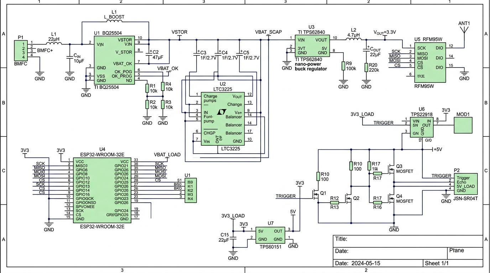

# Hardware Schematics & Circuit Architecture

This document details the complete electrical schematic architecture, component interfacing, power stage calculations, and signal flow for the **Estero-Volt** off-grid telemetry node.

---

## 1. System Power Architecture & Flow

<p align="center">
  
</p>

The Estero-Volt electrical system transforms continuous, ultra-low-voltage DC potential generated by exoelectrogenic biofilms into regulated rails capable of supplying high-current transient RF pulses:

```
 [BMFC Cell]
  Anode (Sludge)  (-) --------+
  Cathode (Oxic)  (+) ---+    |
                         |    |
                         v    v
               +-----------------------+
               | Texas Instruments     |
               | BQ25504 Ultra-Low     |
               | Boost Harvester       |
               | - Cold-Start @ 330mV  |
               | - MPPT Clamped @ 50%  |
               +-----------+-----------+
                           |
                     VSTOR | (Up to 5.0V Charging Rail)
                           v
               +-----------------------+
               | Supercapacitor Bank   |
               | 3x 50F, 5.5V in series|
               | (C_eff = 16.67F)      |
               | High-Z Active Balance |
               +-----------+-----------+
                           |
                     VBAT  | 3.0V - 5.0V Unregulated Rail
                           v
               +-----------------------+      VBAT_OK
               | TI TPS62840           |--------------------+
               | Nano-Power Buck Reg   |                    |
               | (IQ = 60nA, 750mA)    |                    |
               +-----------+-----------+                    |
                           | 3.3V System Rail               |
              +------------+------------+                   |
              |                         |                   |
              v                         v                   v
     +-----------------+       +-----------------+   +--------------+
     | ESP32-WROOM-32E |       | RFM95W LoRa     |   | ESP32 RTC    |
     | Deep Sleep Core |       | Transceiver     |   | GPIO 33 Wake |
     +--------+--------+       +--------+--------+   +--------------+
              |                         |
              | GPIO 25 (PWR_EN)        | SPI / DIO0 / DIO1
              v                         |
     +-----------------+                |
     | High-Side P-FET |                |
     | Load Switch     |                |
     +--------+--------+                |
              |                         |
              v                         |
     +-----------------+                |
     | 5V Boost Reg    |                |
     | (TPS61099)      |                |
     +--------+--------+                |
              | 5.0V                    |
              v                         |
     +-----------------+                |
     | JSN-SR04T Echo  |--[Level Shift]-+
     | Ultrasonic Unit |
     +-----------------+
```

---

## 2. BQ25504 Harvester Subsystem Design

The **Texas Instruments BQ25504** is an integrated energy-harvesting boost converter that features cold-start capability down to $V_{IN} \ge 330\,\text{mV}$ and steady-state extraction down to $V_{IN} \ge 80\,\text{mV}$.

```
                      BQ25504 HARVESTER CIRCUIT
                     +-------------------------+
    BMFC (+) --------| 2  VIN_DC      VSTOR 19 |----+-------> VSTOR / Supercap Bank
    BMFC (-) --------| 3  VSS          VBAT 20 |----+
                     |                         |
     L1 (22uH)       | 1  LBUS         VREF 15 |----[ 0.1uF ]--- GND
    VIN_DC ---[L1]---| 16 VSTOR_SEC            |
                     |                         |
            GND -----| 4  VOC_SAMP     VREF_SAMP|---[ 10nF ]---- GND
                     |    (Tied to GND         |
                     |     for 50% MPPT)       |
                     |                         |
                     | 14 ROV_1        VBAT_OK |----------------> VBAT_OK to ESP32
                     | 13 ROV_2       VBAT_UV  |
                     | 12 ROK_1       VBAT_OV  |
                     | 11 ROK_2                |
                     | 10 ROK_3                |
                     | 9  RUV_1                |
                     | 8  RUV_2        EN_B 6  |---- GND
                     +-------------------------+
```

### 2.1 Maximum Power Point Tracking (MPPT) Configuration
Microbial Fuel Cells behave as biological batteries with significant internal electrochemical and charge-transfer resistance ($R_{int} \approx 5.5\,\Omega$ for PANI-modified felt). By Jacobi's Maximum Power Transfer Theorem, maximum power extraction occurs when:

$$R_{load} = R_{int} \implies V_{MPP} = 0.50 \times V_{OC}$$

The BQ25504 samples the open-circuit voltage ($V_{OC}$) of the BMFC for $256\,\text{ms}$ every $16\,\text{seconds}$. 
* Connecting **`VOC_SAMP` (Pin 4) directly to GND** configures the internal resistor divider ratio to **exactly 50% of $V_{OC}$**.
* An external $10\,\text{nF}$, low-leakage C0G/NP0 ceramic capacitor is placed between **`VREF_SAMP` (Pin 5)** and `GND` to hold the sampled 50% reference voltage during the 16-second harvesting intervals.

### 2.2 Threshold Programming Resistor Calculations
The threshold voltages ($V_{OV}$, $V_{BAT\_OK}$, $V_{BAT\_OK\_HYST}$, $V_{UV}$) are established by high-impedance external resistor ladders. To minimize quiescent leakage, the sum of each resistor branch must be approximately $10\,\text{M}\Omega$ ($13\,\text{M}\Omega$ maximum).

The internal reference voltage is $V_{BIAS} = 1.21\,\text{V}$.

#### A. Overvoltage Protection ($V_{OV}$ = 4.80 V)
Supercapacitors degrade rapidly if their rated dielectric voltage is exceeded. To protect the storage array:
$$V_{OV} = \frac{3}{2} \times V_{BIAS} \times \left(1 + \frac{R_{OV1}}{R_{OV2}}\right) = 1.815 \times \left(1 + \frac{R_{OV1}}{R_{OV2}}\right)$$

Setting $R_{OV1} + R_{OV2} = 10\,\text{M}\Omega$:
$$1 + \frac{R_{OV1}}{R_{OV2}} = \frac{4.80}{1.815} \approx 2.6446 \implies \frac{R_{OV1}}{R_{OV2}} = 1.6446$$
$$R_{OV2} = \frac{10\,\text{M}\Omega}{2.6446} \approx 3.78\,\text{M}\Omega \quad \longrightarrow \quad \mathbf{3.74\,\text{M}\Omega\ (0.1\%)}$$
$$R_{OV1} = 10\,\text{M}\Omega - 3.74\,\text{M}\Omega = \mathbf{6.26\,\text{M}\Omega} \quad \longrightarrow \quad \mathbf{6.19\,\text{M}\Omega\ (0.1\%) + 68\,\text{k}\Omega}$$

#### B. Undervoltage Protection ($V_{UV}$ = 2.40 V)
Prevents supercapacitor deep-discharge below the buck converter's minimum drop-out regulation:
$$V_{UV} = V_{BIAS} \times \left(1 + \frac{R_{UV1}}{R_{UV2}}\right) = 1.21 \times \left(1 + \frac{R_{UV1}}{R_{UV2}}\right)$$

Setting $R_{UV1} + R_{UV2} = 10\,\text{M}\Omega$:
$$1 + \frac{R_{UV1}}{R_{UV2}} = \frac{2.40}{1.21} \approx 1.9835 \implies \frac{R_{UV1}}{R_{UV2}} = 0.9835$$
$$R_{UV2} = \frac{10\,\text{M}\Omega}{1.9835} \approx 5.04\,\text{M}\Omega \quad \longrightarrow \quad \mathbf{4.99\,\text{M}\Omega\ (0.1\%)}$$
$$R_{UV1} = \mathbf{4.99\,\text{M}\Omega\ (0.1\%)}$$

#### C. Battery OK & Hysteresis ($V_{BAT\_OK} = 3.60\,\text{V}$, $V_{BAT\_OK\_HYST} = 3.10\,\text{V}$)
The `VBAT_OK` pin signals the ESP32 that sufficient energy is stored to execute an active sensing and LoRa transmission burst without dropping below brownout.

$$V_{BAT\_OK\_HYST} = V_{BIAS} \times \left(1 + \frac{R_{OK1} + R_{OK2}}{R_{OK3}}\right)$$
$$V_{BAT\_OK} = V_{BIAS} \times \left(1 + \frac{R_{OK1}}{R_{OK2} + R_{OK3}}\right)$$

Selected standard $0.1\%$ high-stability resistors:
* **$R_{OK1} = 4.70\,\text{M}\Omega$**
* **$R_{OK2} = 1.10\,\text{M}\Omega$**
* **$R_{OK3} = 4.22\,\text{M}\Omega$**
* Total string resistance: $10.02\,\text{M}\Omega$ (Leakage current $\approx 360\,\text{nA}$).

---

## 3. Supercapacitor Storage & Active Balancing Circuit

The energy storage subsystem consists of three **50 F, 5.5 V electric double-layer capacitors (EDLCs)** placed in series.

### 3.1 Equivalent Characteristics
* Total Equivalent Series Capacitance ($C_{eff}$):
  $$C_{eff} = \frac{1}{\frac{1}{C_1} + \frac{1}{C_2} + \frac{1}{C_3}} = \frac{50\,\text{F}}{3} \approx \mathbf{16.67\,\text{F}}$$
* Maximum Safe System Voltage:
  $$V_{max} = 3 \times 5.5\,\text{V} = 16.5\,\text{V} \quad (\text{Operated conservatively at } V_{OV} = 4.80\,\text{V})$$
* Total Stored Usable Energy between $4.8\,\text{V}$ and $3.0\,\text{V}$:
  $$E_{usable} = \frac{1}{2} C_{eff} (V_{max}^2 - V_{min}^2) = \frac{1}{2} (16.67\,\text{F}) (4.80^2 - 3.00^2) = \frac{1}{2} (16.67) (23.04 - 9.00) = \mathbf{117.0\,\text{Joules}}$$

At an active cycle consumption of $77.18\,\text{mJ}$, the storage bank contains over **1,500 full telemetry transmission cycles in reserve**, providing months of operational reserve even if biofilm metabolism is completely interrupted.

### 3.2 Cell Balancing Circuitry
Because supercapacitors exhibit leakage currents up to $10 - 25\,\mu\text{A}$ and capacitance tolerances of $\pm 20\%$, cells in series drift in voltage over time. Standard passive bleed resistors ($10\,\text{k}\Omega - 100\,\text{k}\Omega$) bleed hundreds of microamps, which would collapse our $3.2\,\text{mW}$ budget.

**Solution: Ultra-Low-Power Precision Balancing (Advanced Linear Devices ALD910022)**
* Uses monolithic dual/quad MOSFET arrays specifically matched to gate threshold voltages ($V_{t} \approx 2.20\,\text{V}$).
* **Operating Behavior**:
  * When $V_{cell} < 2.00\,\text{V}$, MOSFET drain-source leakage is **$< 10\,\text{pA}$**.
  * As $V_{cell}$ approaches $2.20\,\text{V}$, channel conductance increases exponentially, shunting excess current around the cell without dissipating continuous standby power.

```
       VSTOR Rail (Max 4.8V)
            |
            +------------+
            |            |
         +-----+     +-------+
         | C1  |     | Q1    | ALD910022
         | 50F |     | Bal   | (Threshold ~2.2V)
         +-----+     +-------+
            |            |
            +-----+------+ Mid-Point 1
            |            |
         +-----+     +-------+
         | C2  |     | Q2    |
         | 50F |     | Bal   |
         +-----+     +-------+
            |            |
            +-----+------+ Mid-Point 2
            |            |
         +-----+     +-------+
         | C3  |     | Q3    |
         | 50F |     | Bal   |
         +-----+     +-------+
            |            |
            +------------+
            |
           GND
```

---

## 4. Power Conversion & Load Switching

To achieve high efficiency across four orders of magnitude of current (from $10\,\mu\text{A}$ sleep up to $300\,\text{mA}$ active RF burst), power conversion is decoupled into dual rails:

```
  Supercap Bank (3.0V - 4.8V)
        |
        +-------------------------------------------------------+
        |                                                       |
        v VIN                                                   v VIN
+-----------------------+                               +-----------------------+
| TI TPS62840 Buck Reg  |                               | TI TPS22919 Load Sw   |
| IQ = 60 nA            |                               | (Controlled by GPIO25)|
| VOUT = 3.3V Regulated |                               +-----------+-----------+
+-----------+-----------+                                           |
            |                                                       v VIN
            +------------------------------------+          +-----------------------+
            |                                    |          | TI TPS61099 Boost Reg |
            v VDD                                v VDD      | (3.3V -> 5.0V @ 30mA) |
     +---------------+                    +---------------+ +-----------+-----------+
     | ESP32-WROOM-32|                    | RFM95W LoRa   |             | 5.0V Rail
     | (Main Core)   |                    | Transceiver   |             v VCC
     +---------------+                    +---------------+     +-------------------+
                                                                | JSN-SR04T Sensor  |
                                                                +-------------------+
```

### 4.1 System 3.3V Rail: TI TPS62840DLYR
* **Input Voltage Range**: $1.8\,\text{V}$ to $6.5\,\text{V}$.
* **Operating Quiescent Current**: $60\,\text{nA}$ typical.
* **Output Current**: $750\,\text{mA}$ peak (easily absorbs LoRa $+20\,\text{dBm}$ transmission pulses without voltage sag).
* **Efficiency**: $>92\%$ at $100\,\mu\text{A}$, $>90\%$ at $150\,\text{mA}$.

### 4.2 Gated 5.0V Sensor Rail: High-Side Switch & Boost Converter
The ultrasonic transducer (JSN-SR04T) requires $5.0\,\text{V} \pm 0.25\,\text{V}$ to drive its piezoelectric element with sufficient acoustic power to penetrate humid canal air. Leaving this sensor powered continuously drains $30\,\text{mA}$ ($150\,\text{mW}$), which would deplete the node in minutes.

* **Power Gating**: An integrated high-side P-channel load switch (**TI TPS22919** or discrete **DMP2035U** with a $100\,\text{k}\Omega$ gate pullup) isolates the boost regulator.
* **Control Pin**: ESP32 `GPIO 25 (SENS_PWR_EN)`.
* **5V Boost Converter**: **TI TPS61099x** synchronous boost converter stepping $3.3\,\text{V}$ to $5.0\,\text{V}$ with $< 1\,\mu\text{A}$ shutdown leakage. Turned on only for $35\,\text{ms}$ during acoustic measurement.

---

## 5. Component Interfacing & Signal Conditioning

### 5.1 Ultrasonic Sensor Level Shifting (JSN-SR04T)
The JSN-SR04T operates on a $5\,\text{V}$ rail. Its `ECHO` line outputs a $5\,\text{V}$ CMOS pulse whose duration corresponds to acoustic time-of-flight. **Direct connection to an ESP32 GPIO will exceed the $3.6\,\text{V}$ absolute maximum rating and cause latch-up destruction.**

#### Circuit Implementation:
* **`TRIG` Pin (ESP32 $\to$ JSN-SR04T)**:
  * ESP32 $3.3\,\text{V}$ logic satisfies $V_{IH} \ge 2.0\,\text{V}$ for TTL/CMOS inputs on the sensor. Direct drive via `GPIO 32` with a series $330\,\Omega$ damping resistor.
* **`ECHO` Pin (JSN-SR04T $\to$ ESP32)**:
  * Bi-directional N-Channel MOSFET level shifter (**BSS138**) or a precision, low-impedance resistor voltage divider:

```
               +5V (Gated)               +3.3V System
                    |                         |
               [10k pullup]              [10k pullup]
                    |                         |
  JSN-SR04T         |       BSS138 NMOS       |          ESP32
  ECHO Pin ---------+-------S |<--- D --------+--------- GPIO 35 (Input Only)
                              |
                             Gate
                              |
                            +3.3V
```

* **Passive Resistor Divider Alternative**:
  $$V_{OUT} = V_{ECHO} \times \frac{R_2}{R_1 + R_2} = 5.0\,\text{V} \times \frac{3.9\,\text{k}\Omega}{2.2\,\text{k}\Omega + 3.9\,\text{k}\Omega} = 5.0 \times 0.6393 = \mathbf{3.19\,\text{V}}$$
  * A **BAT54S** dual Schottky diode is placed at the ESP32 input pin, clamping negative undershoots to $-0.3\,\text{V}$ and positive spikes to $V_{DD} + 0.3\,\text{V}$.

### 5.2 LoRaWAN Transceiver Netlist (Semtech SX1276 / RFM95W)
The RFM95W is tied directly to the ESP32 hardware SPI bus (VSPI):

| RFM95W Pin | ESP32 GPIO | Net Name | Function / Description |
| :--- | :--- | :--- | :--- |
| **`NSS`** | `GPIO 5` | `LORA_CS` | Active-Low SPI Chip Select (External $10\,\text{k}\Omega$ pullup) |
| **`SCK`** | `GPIO 18` | `LORA_SCK` | SPI Clock (Up to 10 MHz) |
| **`MISO`** | `GPIO 19` | `LORA_MISO`| SPI Master-In-Slave-Out |
| **`MOSI`** | `GPIO 23` | `LORA_MOSI`| SPI Master-Out-Slave-In |
| **`RST`** | `GPIO 14` | `LORA_RST` | Active-Low Hardware Reset |
| **`DIO0`** | `GPIO 26` | `LORA_DIO0`| Interrupt: TxDone / RxDone (Critical for LMIC stack) |
| **`DIO1`** | `GPIO 27` | `LORA_DIO1`| Interrupt: RxTimeout (Required for LoRaWAN Class A) |
| **`DIO2`** | `NC` | - | FSK Mode Only (Unused in LoRa mode) |
| **`ANT`** | - | `RF_OUT` | $50\,\Omega$ matched coplanar line to SMA female / helical ant |

### 5.3 Hardware Deep Sleep Supervisor Netlist
To eliminate RTC timer drift and guarantee that the node never attempts a boot during marginal power conditions, wake-up is managed directly by the BQ25504 supervisor:

* **`VBAT_OK` (BQ25504 Pin 18)** $\longrightarrow$ **ESP32 `GPIO 33 (RTC_IO 8)`**.
* **Electrical Configuration**:
  * The BQ25504 `VBAT_OK` is a push-pull driver.
  * In the ESP32 firmware, `GPIO 33` is configured as an external RTC wake-up source:
    ```cpp
    esp_sleep_enable_ext0_wakeup(GPIO_NUM_33, 1); // Wake on logic HIGH (VBAT >= 3.6V)
    ```
  * When $V_{STOR} \ge 3.60\,\text{V}$, `VBAT_OK` asserts HIGH, releasing the ESP32 from deep sleep.
  * If the supercapacitor drains to $3.10\,\text{V}$ during extreme RF bursts, `VBAT_OK` falls to LOW, preventing re-triggering until the BMFC replenishes the bank to $3.60\,\text{V}$.

---

## 6. Supercapacitor Voltage Monitoring ADC Circuit

To log node health and dynamically adjust telemetry cadence via Adaptive Duty Cycling, the ESP32 measures the supercapacitor bank voltage:

```
  Supercap Bank (VBAT: 3.0V - 4.8V)
             |
             v
       +-----------+
       | R_ADC1    | 2.0 M-Ohm (0.1%)
       +-----+-----+
             |
             +---------------+----------> ESP32 GPIO 34 (ADC1_CH6)
             |               |
       +-----+-----+   +-----+-----+
       | R_ADC2    |   | C_ADC1    | 100 nF Ceramic (Noise filter & Low-Z buffer)
       | 1.0 M-Ohm |   +-----+-----+
       | (0.1%)    |         |
       +-----+-----+         |
             |               |
             +---------------+
             |
            GND
```

* **Divider Ratio**:
  $$V_{ADC} = V_{BAT} \times \frac{1.0\,\text{M}\Omega}{2.0\,\text{M}\Omega + 1.0\,\text{M}\Omega} = \frac{V_{BAT}}{3}$$
* At $V_{BAT\_MAX} = 4.80\,\text{V}$, $V_{ADC} = 1.60\,\text{V}$ (well within the linear attenuation range of the ESP32 ADC at `ADC_ATTEN_DB_11` or calibrated `ADC_ATTEN_DB_6`).
* **Standby Current Draw**:
  $$I_{leak} = \frac{4.8\,\text{V}}{3.0\,\text{M}\Omega} = \mathbf{1.6\,\mu\text{A}}$$
